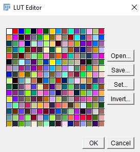
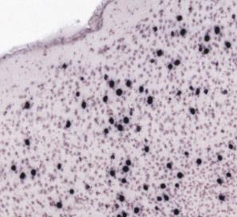
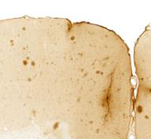
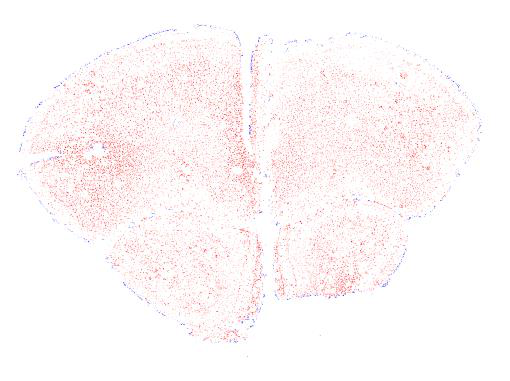
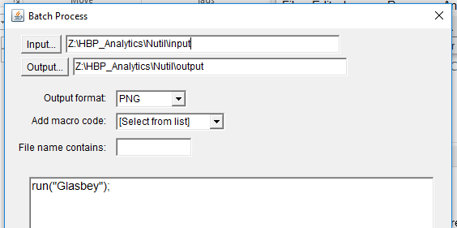

**ilastik**
===========

**Introduction**
-----------------

* This manual was written by the Nesys group at the University of Oslo with input from the ilastik team to describe the use of `ilastik <http://ilastik.org/>`_ for the QUINT workflow only.

* *ilastik* is a versatile image analysis tool designed for the batch classification, segmentation and analysis of biological images based on supervised machine learning algorithms.

* *ilastik* has many additional functions and workflows that are not mentioned in this manual. For more information see www.ilastik.org

**Installation and Usage**
--------------------------

* The ilastik program can be `downloaded here. <http://ilastik.org/download.html>`_

* See the ilastik website for the most up-to-date information.

|
**Preparing the images for ilastik**
---------------------------------

**Image size**

As a general rule the histological images should be downscaled before segmenting with ilastik. This improves the output quality and speeds up the analysis. 

The optimal resize factor will depend on the original size of the images and the size of the features to be extracted, and is determined by trial and error. The Pixel Classification algorithm extracts image pixels based on their colour, intensity and / or texture on a scale up to 10 sigma. This means that the algorithm recognises edges or objects that fall within a 10 x 10 pixel window. For the best result, resize the images so that the objects (e.g. cells) fall well within this window, but without loss of important information (e.g. small cells).  A resize factor of 0.2 or 0.1 may be a good starting point. 

**File format**

ilastik supports many `file formats. <https://www.ilastik.org/documentation/basics/dataselection>`_ PNG works well. It does not support tiled TIFFs.

**Software Recommendations**

Nutil enables image resizing, renaming and file format conversion and is specifically designed for histological images from mouse and rat. 

 * the Resize feature enables conversion of PNG or JPEG images to PNG format. 
 * the Transform feature is designed to transform tiled TIFF images with output in tiled TIFF format, but also has the option to generate thumbnails in PNG format. To generate images for ilastik only, switch on the “only create thumbnails” feature under the advanced settings and enter the desired resize factor. Transform also enables rotation of images and file renaming to comply with the QUINT naming convention.  
 
|
**Segmentation with ilastik**
------------------------------

There are two main approaches for the segmentation of brain section images with ilastik.

1. Pixel classification only (with two or more classes)
2. Pixel classification with two classes (*immunoreactivity* and *background*), followed by object classification with two classes (*objects* *e.g. cells* and
   *artefact*).

**Which approach is best?**

The best approach depends on the appearance of the labelling in the images and is determine by trial and error.

1. The first approach is quick and easy, and is the method of choice as long as it produces satisfactory output. It is suited for images in which there are clear differences in the colour, intensity and / or texture of the features of interest (e.g. cells) relative to the background and other structures. For example:

|image5|

2. The second approach is more time consuming, but may give a better output if there is non-specific labelling in the image that is similar in appearance to the labelling-of-interest. This is because the object classification workflow can filter out non-specific labelling based on object level features such as size and shape. A classical example is cells and edge staining of similar colour and intensity that are both extracted by pixel classification, but have different object shapes and so are easy to differentiate with object classification (round cells versus long and thin edge staining). For example: 

|image6|

**1. Pixel Classification Workflow**
~~~~~~~~~~~~~~~~~~~~~~~~~~~~~~~~~~

For a quick introduction, watch: 

.. raw:: html

<iframe width="560" height="315" src="https://www.youtube.com/embed/5N0XYW9gRZY" title="YouTube video player" frameborder="0" allow="accelerometer; autoplay; clipboard-write; encrypted-media; gyroscope; picture-in-picture" allowfullscreen></iframe>

1. Open the *ilastik* programme. Under ‘Create New Project’ select ‘Pixel Classification’. Save the project under a new file name in the same location as the images for analysis (create a new folder). 

   .. image:: 2e9537b09637491fa83410e3e364d5c5/media/image3.png
      :width: 3.34444in
      :height: 2.2491in

2. On the left hand side of the screen there are five input applets.

   .. image:: 2e9537b09637491fa83410e3e364d5c5/media/image4.png
      :width: 2.76667in
      :height: 1.59511in

In the **Input data** applet, select ‘Add New’.  Add one or more images for the purpose of training the classifier (training images). Convert the format of the images to HDF5 to increase the processing speed.  To do this, highlight the uploaded images, select ‘storage’ and change from ‘relative link’ to ‘copied to project file’.  Save the project.

   .. image:: 2e9537b09637491fa83410e3e364d5c5/media/image5.png
      :width: 4.07083in
      :height: 1.07782in

3. Select the **Feature Selection** applet and click ‘Select Features’.

   .. image:: 2e9537b09637491fa83410e3e364d5c5/media/image6.png
      :width: 6.16667in
      :height: 1.23194in

Select the features and scales that can be used to discern the objects or classes of interest:  for most datasets, all the features should be selected. See FAQ for advice on selecting good features.

4. Select the **Training** applet. To scroll around the image, press **shift** and use the mouse wheel to navigate. To zoom, press **ctrl** and use the mouse wheel to zoom in and out. Click ‘add label’ to create two or more classes. See FAQ for advice on the number of classes to use.

5. Label some example pixels of each class with the paintbrush, and remove labels with the eraser. Select ‘live update’ to begin the machine learning and prediction process.  Turning on the uncertainty overlay, by clicking on the uncertainty eye, will help in the labelling process as it identifies pixels of which ilastik is unsure of the class.  By correctly labelling these pixels, the prediction rapidly improves. See FAQ for advice on placing labels.   

6.	The ‘probability’ and ‘segmentation’ overlays should be turned on to inspect the final result. 

7.	On completion of training, select the Prediction Export applet.  Export “probability maps” in HDF5 format, and “simple_segmentation” images in 8-bit PNG format in turn, with the default settings. Do not alter the export location. The files will automatically save in the same location as the input files. 

8.	The files can either be exported individually by clicking the export button in the Prediction Export applet, or in batch (see step 9). 

9.	For batch processing of images with the trained classifier, select the Batch Processing applet.  Upload the images to be analysed, and select ‘process all files’.  The time taken to process the files will depend on the size and number of files selected.  

10.	 Save the ilastik file before closing. 

**NOTE: Save the ilastik file frequently during the annotation process**.

**2. Object Classification Workflow**
~~~~~~~~~~~~~~~~~~~~~~~~~~~~~~~~~~

1.	There are three options on the ilastik start up page for running Object Classification.  Choose the Object Classification with Raw Data and Pixel Prediction Maps as input.  It is not advisable to use Pixel Classification + Object Classification. This file type is easily corrupted.

2.	Save the object classification file in the same folder as the raw images for analysis.  If the images are moved after the ilastik file is created, the link between the ilastik file and the images may be lost, resulting in a corrupted file.

3.	In the Input Data applet, upload the original images and their respective probability maps in HDF5 format (output from the pixel classification).    

4.	In the Threshold and Size Filter applet, select:
* The simple method.
* The input channel that corresponds to the label of interest. 
* Smoothing factor for the x and y axis. In general, the same value should be selected for each. Determine the most appropriate factor by trial and error: the goal is to achieve object shapes that are most representative of the real data. Zero is often advisable – in which case no smoothing filter is applied.
* Threshold. The probability threshold can range from 0 to 1: with zero representing no exclusion of pixels; and 1 representing exclusion of all pixels except those with 100% probability of belonging to the class-of-interest. In reality only the pixels that were manually annotated in the Pixel Classification workflow have a 100% probability of belonging to the class-of-interest. A good compromise is 0.4.

5.	In the Object Feature Selection applet, select all the features (except those relating to location within the image).

6.	In the Object Classification applet, create two classes (label and artefact) and label some example objects of each class. Tick the live update box.  Continue annotating until you are happy with the predictions. 

7.	In the Object Information Export applet, export “Object Predictions” in 8-bit PNG format.  Do not change the default export location.

8.	For batch processing, use the Batch Processing applet. Upload the raw images and corresponding prediction maps and “process all files”.

**3. Applying the Glasbey Lookup table**
~~~~~~~~~~~~~~~~~~~~~~~~~~~~~~~~~~~~~~

The 8-bit PNG output of ilastik (Simple_Segmentations and Object_Predictions) are always black or white in appearance. To visualise the results, and make them compatible with Nutil Quantifier, apply the Glasbey lookup table (LUT) to the images with NIH ImageJ or Fiji.  

|image8|

1.	Download the NIH ImageJ tool.
2.	Open the image in ImageJ. The image appears black (or white). 
3.	Apply the Glasbey lookup table by selecting Image > Lookup Tables > Glasbey.  This assigns a different colour to each label. Save the image in PNG format. They are now compatible with Nutil Quantifier. 

**Customise the LUT**

In some cases you may wish to alter the applied colours. To do this, select Image > Color > Edit LUT. The LUT applies colours from the top left hand corner (first colour is not used). Click on each colour to alter it. Then Save the customised LUT and save the image in PNG format. 

**Batch processing: Apply the Glasbey LUT to a folder of images**

1. To apply the Glasbey lookup table to a whole folder of segmented images, select:

**Process >Batch> Macro**; select the input and output folders, required file type, and type the following code in the macro box: **run("Glasbey");**

+----------+
| |image9| |
+----------+

2. To apply the customized LUT to a folder of images, first save the
customized LUT as a .LUT file. Apply to a whole folder of images with the Batch Processing feature. Select: **Process** > **Batch** > **Macro**. Select the input and output directories and output format PNG, and type the following macro:

   open(“C:\\......\\....\\....\\filename.lut”);

   **Note: Make sure to update the directory so it locates the customized.lut file, and ensure the macro is written with double back slashes.**

   .. image:: 2e9537b09637491fa83410e3e364d5c5/media/image11.png
      :width: 4.39583in
      :height: 1.85088in

|
**FAQ and troubleshooting**
---------------------------

**1. Which pixel classification features should I select?**
~~~~~~~~~~~~~~~~~~~~~~~~~~~~~~~~~~~~~~~~~~~~~~~~~~~~~~~~

The features and scales to select are those that distinguish the different classes in the image.  As it is not always obvious which features and scales distinguish the classes, it is best to select all the features and scales for the pixel classification in the first instance. Selecting fewer features and scales may speed up the analysis, so refining the selection may be helpful at a later stage.

Note that the scale corresponds to the pixel diameter of the feature. For example, if a textural pattern has a pixel size of 4, the scale of the texture has a sigma of 4.  As the maximum scale of the features available in ilastik is 10, ilastik is not capable of recognising objects based on edge if the objects are larger than approximately 60 pixels (the whole object should be visible in 10 x 10 pixel window).  

**2. Which images should I upload in the Input Data applet?**
~~~~~~~~~~~~~~~~~~~~~~~~~~~~~~~~~~~~~~~~~~~~~~~~~~~~~~~~~~

Only training images should be uploaded in the **Input Data** applet (~10 is good).

**3. What are training images?**
~~~~~~~~~~~~~~~~~~~~~~~~~~~~~~

Training images are a subset of the whole image series that you annotate in the training phase. Choose images that contain labelling that is representative of the labelling in the whole series. It is good to select images that span the full volume, as labelling often varies in different anatomical regions (for example, every 4th section). The same subset can be used for the pixel and object classification workflows. 

**4. How many classes should I use?**
~~~~~~~~~~~~~~~~~~~~~~~~~~~~~~~~~~

The number of classes to annotate will depend on the classification approach. 
* For Pixel Classification only, create two or more classes. As a general rule, the fewer the better. 
* For Pixel Classification with Object Classification, annotate two classes in each classification step.  

**5. Which part of the image, and how much, should I label?**
~~~~~~~~~~~~~~~~~~~~~~~~~~~~~~~~~~~~~~~~~~~~~~~~~~~~~~~~~~

Start by zooming-in and annotating a few pixels of each class that clearly belong to their respective class.  Turn on the ‘live update’ to view the predictions. The ‘uncertainty’ overlay can be switched on to identify pixels with uncertain class prediction (it identifies these pixels in bright blue).  By annotating these pixels, the prediction quickly improves.

Note that even just a few incorrectly annotated pixels can disrupt the prediction.  If in doubt, it is better to delete annotations and start again, rather than continuing with the annotation.  By ticking the ‘segmentation’ box you can view the final segmentation based on the classifier.  When you are happy with this, stop annotating and test the trained classifier on the next training image.

**6. How do I test the trained classifier on the other images in the series?**
~~~~~~~~~~~~~~~~~~~~~~~~~~~~~~~~~~~~~~~~~~~~~~~~~~~~~~~~~~~~~~~~~~~~~~~~~~~~~~~~~~

To test the ability of the trained classifier to segment a new image, select ‘current view’ in the Training applet and choose a new training image from the drop-down menu.  Press ‘live update’ and view the ‘segmentation’ overlay.  If you are not happy with the classification you can annotate pixels on the new image to improve the prediction.  When satisfied with the result, the trained classifier can be tested on a third image.  Continue this processes until you are satisfied that the classifier is optimally trained for the image series.  You are now ready for batch processing.

**7. Which export settings should I select?**
~~~~~~~~~~~~~~~~~~~~~~~~~~~~~~~~~~~~~~~~~~

The file type to export will depend on the plan for the next step of analysis. 

* In the Pixel Classification workflow, export Simple_Segmentation.PNG to visualize the segmentation, or Prediction_maps.H5 to continue with Object Classification.
* In the Object Classification workflow, export Object_Predictions.PNG.
* The PNG images should be export as unsigned 8-bit images. 
* Do not alter the output location. The default export location is the folder in which the ilastik file is located.  If the output location is altered, the file will fail to export.  This is a bug in the system!  

**8. Help! ilastik keeps crashing. I have very large images. What do I do?**
~~~~~~~~~~~~~~~~~~~~~~~~~~~~~~~~~~~~~~~~~~~~~~~~~~~~~~~~~~~~~~~~~~~~~~~~~~

* While ilastik has the computational power to process very large images, the viewer in the ilastik user interface is not able to process whole images that are very large in the “live” mode. For large images in the training phase, it is therefore important to remain zoomed-in in the viewer when the live update is switched on. This is especially true if many classes are labelled and many features selected.  As a general rule of thumb, keep the portion of the image that is visible in the viewer to below 3000 x 3000 pixels.  The absolute value will depend on the number of classes and features selected.
* For very large images, be more selective with the features for classification, and label as few classes as possible.  
* If all else fails, it is possible to split large images into tiles and process tiles individually. These have to be stitched before continuing with the QUINT workflow. 
* Note that exportation of the segmented images will take time.  One large image (e.g. 30,000 x 30,000 pixels) may take 2 hours to export.  Image analysis can be run overnight in the batch mode.            

**Technical information**
--------------------------

This manual was written by the Neural Systems Laboratory at the University of Oslo, Norway, for the use of ilastik for the QUINT workflow, and includes tips and tricks from the ilastik team. Some of this information may be out of date. 

For the latest updates and user documentation see: https://www.ilastik.org/ 

**How to cite**

**ilastik: interactive machine learning for (bio)image analysis**
 
Stuart Berg, Dominik Kutra, Thorben Kroeger, Christoph N. Straehle, Bernhard X. Kausler, Carsten Haubold, Martin Schiegg, Janez Ales, Thorsten Beier, Markus Rudy, Kemal Eren, Jaime I Cervantes, Buote Xu, Fynn Beuttenmueller, Adrian Wolny, Chong Zhang, Ullrich Koethe, Fred A. Hamprecht & Anna Kreshuk in: Nature Methods, (2019)
     
**QUINT workflow**
     
Yates SC, Groeneboom NE, Coello C, Lichtenthaler SF, Kuhn P-H, Demuth H-U, Hartlage-Rübsamen M, Roßner S, Leergaard T, Kreshuk A, Puchades MA and Bjaalie JG (2019) QUINT: Workflow for Quantification and Spatial Analysis of Features in Histological Images From Rodent Brain. Front. Neuroinform. 13:75. doi: 10.3389/fninf.2019.00075.

