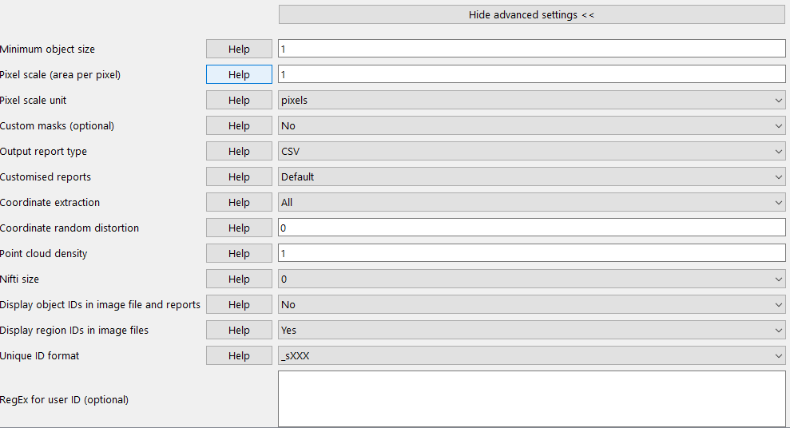

**Quantifier**
-------------------------

*Quantifier* is an integral part of the QUINT workflow, and enables the regional quantification of features extracted from histological images based on a reference atlas such as the Allen Mouse Brain Atlas (AMBA) or the Waxholm Atlas of the Spraque Dawley Rat. For an overview watch: https://www.youtube.com/watch?v=yPkAbSfla_c 

Quantifier requires three sets of input: segmentation images, atlas maps, and anchoring information in XML or JSON format. It generates three sets of output: reports with quantifications per atlas region, overlay images with the segmentations superimposed on the atlas maps, and coordinate files for visualising the extracted objects in the 3D brain viewer *Meshview*. As the QUINT workflow is relatively complex, and requires the use of several software packages including ilastik, QuickNII and Nutil Quantifier, this section is split into several parts with information on how to prepare the input files, how to run Quantifier, and how to interpret the output files.     

**Preparing the Quantifier input files**
~~~~~~~~~~~~~~~~~~~~~~~~~~~~~~~~~~~~

**1. File naming requirement**

* The file names of the *segmentation files* and the *atlas maps* that correspond to a particular section image must contain the same unique ID. These unique IDs must also be present in the XML or JSON file containing the anchoring information. This happens automatically as long as the images that are anchored with QuickNII contain the unique IDs.

* By default Quantifier supports IDs in the format: _sXXX.., with XXX.. representing the section number. The section number should reflect the serial order and spacing of the sections as this is a requirement for the QuickNII software (e.g. _s002, _s006, _s010 for every 4th section starting with section 2). Example: tg2345_MMSH_s001_segmentation.png. It is fine to include a string of letters and numbers followed by the unique ID. As Quantifier scans and detects the "_s" part of the name, the file name should not contain additional "_s". Example that would not work: tg2345_MMSH_ss_s001.png.

**As the _sXXX naming convention applies to both QuickNII and Quantifier, we strongly recommend changing the file names as the first step in the QUINT workflow. This can be done with Transform.**

* Quantifier also supports user-defined IDs using regular expressions – RegExp. This means that it is possible to get round the _sXXX... naming convention. While this is not recommended, it is useful in some cases. For more information on this see the “help” button in the Nutil GUI or contact user support.  

|

**2. Preparing the segmentations**
 
Any image analysis software may be used to generate the segmentations as long as they meet the requirements listed below. 

**Requirement:**

* Must be indexed 8-bit or 24-bit RGB images in PNG format.
  
* Must have the same proportions as the images used to generate the atlas maps (not the same proportions as the actual atlas maps as QuickNII alters the proportions slightly). They do not need to be the same size as the images used to generate the atlas maps, and are typically larger in size.
  
* Quantifier is only able to extract one RGB (Red Green Blue) colour at a time. Apply one RBG colour to all of the objects of interest, and specify this colour code in the GUI (e.g. the objects in the segmentation here are red, which is RGB colour code: 255,0,0).
  
+----------+
| |image11||
+----------+

|

   **ilastik** 

   We recommend the Pixel and Object Classification workflows in the ilastik software to generate the segmentations with the Glasbey lookup table applied with Fiji to visualise the output. A user manual that describes how to use ilastik in the context of the QUINT workflow is included as part of the Nutil package, see: ilastik userguide. ilastik is available to download at: http://ilastik.org/download.html. 
   
|

**3. Preparing the atlas maps** 
 
The atlas maps are customised to match the cutting plane and proportions of the brain sections. They are generated with either the QuickNII software that applies linear registration only, or with the VisuAlign software that applies nonlinear refinement to an existing QuickNII anchoring file. The atlas maps are in .FLAT format and cannot be directly viewed. The image below shows the information contained in the atlas map, but is not the .FLAT file itself.

+----------+
| |image12||
+----------+

|

  **QuickNII**

  * QuickNII is a standalone software for affine spatial registration (anchoring) of section images - typically high resolution histological images - to a reference atlas such as the Allen Mouse Brain Atlas or the Waxholm Atlas of the Sprague Dawley Rat. In QuickNII, the reference atlas is transformed to match anatomical landmarks in the experimental images. In this way, the spatial relationship between experimental image and atlas is defined, without introducing transformations in the original experimental images. 

  * Once all the sections are registered, QuickNII may be used to generate atlas maps that match the cutting plane and proportions of the experimental image data. The anchoring information (coordinates) is saved and stored in an XML or JSON file.   

  * The registration is user-guided with some automation. Following anchoring of a limited number of sections containing key landmarks, transformations are propagated across the entire series of images to reduce the manual work required. These propagations must be validated by visual inspection and typically require fine adjustments for most sections. A user manual that describes how to use QuickNII in the context of the QUINT workflow is included as part of the Nutil package. See: QuickNII userguide. 

  **VisuAlign**

  * VisuAlign is a standalone software for applying nonlinear refinements (inplane) to an existing affine 2D-to-3D registration (the 2D-to-3D registration is performed with QuickNII and stored in the JSON file). It is used to make manual adjustments to the atlas maps to better match the sections. The adjustments are nonlinear.  

  * Open the JSON file from QuickNII in VisuAlign and apply adjustments by simple drop and drag of markers placed on the image. The adjusted atlas maps may then be exported in .FLAT format and are compatible with Quantifier. VisuAlign does not update the linear coordinate information contained in the JSON file. A user manual that describes how to use VisuAlign in the context of the QUINT workflow is included as part of the Nutil package. See: VisuAlign userguide.

  Visit and download QuickNII and VisuAlign here: https://ebrains.eu/service/quicknii-and-visualign 

**4. Preparing the XML or JSON file containing the anchoring information.**
 
Either the XML or JSON file from QuickNII, or the JSON file from VisuAlign may be used. They all contain the linear registration information that is needed to generate coordinate output. Nonlinear adjustment of the atlas maps with VisuAlign does not alter the linear coordinate information contained in the file. 

**OBS! Make sure your XML or JSON file has anchoring information for every section image in your dataset.**

|

**How to run Quantifier**
~~~~~~~~~~~~~~~~~~~~~~~~~~~~

1. Create three new folders: for example, titled “Segmentations”, “Atlas_maps” and “Output”. Transfer the segmentations to the segmentation folder, the atlas maps to the atlas map folder. Leave the output folder empty. 
2. To begin, click “New”. Enter a name for your project. 
3. Press the “browse” buttons and navigate to the folders containing the segmentations, the atlas maps and the output folder, and to the XML or JSON file containing the anchoring information.  
4. Select the reference brain atlas. This must match the version which was used to generate the atlas maps (Allen mouse brain 2015 or 2017, or Waxholm Space Atlas of the Sprague Dawley Rat v2 or v3).   
5. Fill in the rest of the form. The software includes an inbuilt user manual accessible via the “Help” buttons, and gives more information for each parameter. Some of these are described in more detail in the section below.  
6. The “show advanced settings” button reveals more settings that may be altered (e.g. min object size cut-off, option to generate customised reports, etc). This gives flexibility for customised analysis. If nothing is changed in the advanced settings, the default settings shown below are applied.
7. Press “Save as”. This saves a copy of the settings in a simple text file in .NUT format. This is useful for future reference, and may be reloaded into Nutil via the “load” button (for example, to repeat the analysis on a new set of images). 
8. Nutil automatically detects the number of core processor (threads) available on the computer (8 in the example). To ensure adequate processing power, choose one less than the total available (6 or 7 here) and press “Start”. Wait until the process is complete.  
9. The output files are automatically saved in the specified output folder.  

+-----------------------------+---------------------------------------+
|    **Advanced Parameter**   |    **Default settings**               |
+=============================+=======================================+
|    Minimum object size      |    1 pixel                            |
+-----------------------------+---------------------------------------+
|    Pixel scale              |    1 pixel                            |
+-----------------------------+---------------------------------------+
|    Use custom masks         |    No                                 |
+-----------------------------+---------------------------------------+
|    Output report type       |    CSV                                |
+-----------------------------+---------------------------------------+
|    Apply customised regions |    Default                            |
+-----------------------------+---------------------------------------+
|    Coordinate extraction    |    All (Yes, for whole series and per |
|                             |    section)                           |
+-----------------------------+---------------------------------------+
|    Pixel density            |    1 coordinate per pixel             |
+-----------------------------+---------------------------------------+
|    Nifti size               |    0 (no nifti file generated)        |
+-----------------------------+---------------------------------------+
|    Unique ID format         |    _sXXX…                             |
+-----------------------------+---------------------------------------+

|
+----------+
| |image13||
+----------+

|

**Quantifier settings explained**
~~~~~~~~~~~~~~~~~~~~~~~~~~~~~~~~~

Nutil has “help” buttons throughout with information on each parameter.  

Some of the Quantifier settings are described in more detail below:  

**1. Object splitting**

In Quantifier, users must specify whether to turn “object splitting” ON or OFF. Object splitting divides segmented objects that overlap atlas regions, with individual pixels assigned to their precise location. This gives accurate load measurements (load is the percentage of the region occupied by objects), but invalidates the object counts as objects that overlap region boundaries will be divided into two or more objects. With object splitting switched OFF, the object counts are correct, but the load measurements may be incorrect since objects that overlap region boundaries will be assigned to one of the regions at random, potentially skewing the load calculations. This is especially true if objects are large, since a large object that overlaps many regions (e.g. 1000 pixels) may be assigned to a small region (e.g. 100 pixels) giving a crazy load output (1000%).

RECOMMENDATION:  
Select NO for small objects to get accurate object counts (e.g. cells).  
Select YES for large objects that overlap atlas regions (e.g. connectivity data). This gives precise load output. 

See the help buttons in Nutil for more information. 
 
**2. Custom masks**

The mask feature is optional. It allows the application of masks to define which parts of the sections to include in the analysis. The mask is applied in addition to, and not instead of, the reference atlas maps. This is particularly useful for investigating expression differences in the right and left hemisphere, as a mask can be applied to differentiate the two sides.  

* To use the mask feature, select “yes”. This brings up a “custom mask folder” and “Custom mask colour” option.  
* Create binary masks (black and white) in PNG format with an application such as NIH ImageJ, Adobe Photoshop or GIMP. These should have the same proportions as the segmentations (but not necessarily the same size).  
* Name these with the unique ID for the section and a “_mask” extension. File name example: Bxb_hgt_s002_mask 
* Navigate to this folder containing the masks.  
* Click on the field for the “Custom mask colour”. Select the colour in the mask that corresponds to the ROI to include in the analysis. For example, for an analysis of the left hand side of an image with the mask shown here, specify black (RGB code: 0,0,0). 

+-----------+
| |image16| |
+-----------+

|

**3. Customised reports: how to define your own regions**

Quantifier generates two or three sets of reports: 

* RefAtlasRegion reports contain quantifications per atlas region based on the finest level of granularity of the atlas. 
* CustomRegion reports contain quantifications for broader regions, such as cortex and hippocampus (“default”), or user defined regions (“custom”).  
* Object reports contain information about individual objects and are only generated with object splitting switched OFF.  
 
The custom regions are compilations of reference atlas regions. Users have the option to either define their own using the CustomRegionsTemplate.xlsx, or to use the default regions included in the Nutil software. 

More information on the default regions are found in the CustomRegion files in the Nutil package (see folder titled “CustomRegion” and navigate to the xlsx file that corresponds to your atlas). The “default” option is a whole brain analysis. It includes all the reference atlas regions subdivided into broad regions. 

1. To define your own regions, use the *CustomRegionsTemplate.xlsx* that
is included in the Nutil package, and populate as described below:

.. image:: cfad7c6d57444e3b93185b655ab922e0/media/image12.png
   :width: 4.80278in
   :height: 3.60427in
|

**ROW 1:** assign your own names to the regions (e.g. Cortex).

**ROW 2:** assign colours to the regions. Do this by typing a RGB colour code in the following format: 255;0;0 (for red). This colour will be assigned to the objects located in the custom region for the purposes of the image and coordinate output (for display purposes only).

**ROW 3:** enter the colour name (this is for your information only).

**ROW 4:** define the region by listing the reference atlas IDs that you wish to include. The excel sheets in the AtlasHierarchy folder list all the regions and IDs for each atlas.  
 
For mouse, see the ABAHier2015.xlsx or ABAHier2017.xlsx file for the full list of regions and IDs. 
 
For rat, see the WHS_rat_atlas_v2.xlsx or WHS_rat_atlas_v3.xlsx file for the full list of regions and IDs.  
 
Use the default .xlsx may be used as a guide for filling out the template.  

|

**How to interpret the output**
~~~~~~~~~~~~~~~~~~~~~~~~~~~~~~~

**1. REPORTS** 

   .. image:: cfad7c6d57444e3b93185b655ab922e0/media/image13.png
      :width: 5.88611in
      :height: 2.86512in

**RefAtlasRegion report**
   
Report with output organised based on all the regions in the reference atlas: per section and for the whole series (all sections combined).  

**IMPORTANT**: The Allen Mouse Brain Reference Atlas includes regions that are not actually delineated in the atlas. These regions are either big regions that have been delineated into smaller regions and so are not assigned to any pixels in the reference atlas, or are smaller regions that are not delineated. In the reports, these regions have no results (zero for region pixels and for object pixels) and should be excluded from analysis.  

The **Clear Label** ID covers objects that fall outside of the atlas maps
 
**CustomRegion report**

Reports with the output organised based on the customised regions defined in the CustomRegionsTemplate.xlsx: per section and for the whole series

**Object report**

List of all the objects in the whole series and per section. By switching “ON” the “display object IDs in image file and reports” feature, a unique ID is assigned to each object in your dataset. These IDs are then displayed in the image files and in the object reports.  

In each report, interpret the results as follows:

+----------------------+----------------------------------------------+
|    **Region pixels** |    No. of pixels representing the region.    |
+======================+==============================================+
|    **Region area**   |    Area representing the region              |
+----------------------+----------------------------------------------+
|    **Area unit**     |    Region area unit                          |
+----------------------+----------------------------------------------+
|    **Object count**  |    No. of objects located in the region.     |
|                      |                                              |
|                      |    | NOTE: Object counts are not generated   |
|                      |      if object splitting is                  |
|                      |    | switched “on”.                          |
+----------------------+----------------------------------------------+
|    **Object pixels** |    No. of pixels representing objects in     |
|                      |    this region.                              |
+----------------------+----------------------------------------------+
|    **Object area**   |    Area representing objects in this region. |
+----------------------+----------------------------------------------+
|    **Load**          |    Ratio of Object pixels to Region pixels   |
|                      |    (Object pixels/Region                     |
|                      |                                              |
|                      |    pixels).                                  |
+----------------------+----------------------------------------------+

|

**2. IMAGES**

* Segmentations superimposed on the atlas maps in PNG format.  
* The object colours are assigned based on the customised regions. If no regions are specified, or object falls outside of the specified areas, the objects are shown in red by default

**3. COORDINATES**  
 
* JSON files containing point clouds that can be visualised with the MeshView Atlas Viewer. 
* The viewer is available via the MediaWiki link here: www.nitrc.org/projects/meshview.

**4. NUT FILE** 

The NUT file is a text file containing the analysis settings. This can be loaded into Nutil Quantifier with the “load” button. To view, open with Notepad.

.. |image1| image:: cfad7c6d57444e3b93185b655ab922e0/media/image2.png
   :width: 6.30139in
   :height: 2.33688in
.. |image2| image:: cfad7c6d57444e3b93185b655ab922e0/media/image3.png
   :width: 6.30139in
   :height: 2.95442in
.. |image3| image:: cfad7c6d57444e3b93185b655ab922e0/media/image4.png
   :width: 6.30139in
   :height: 3.52274in
.. |image4| image:: cfad7c6d57444e3b93185b655ab922e0/media/image5.png
   :width: 6.30139in
   :height: 2.87841in
.. |image5| image:: cfad7c6d57444e3b93185b655ab922e0/media/image5.png
   :width: 6.30139in
   :height: 2.87841in
.. |image6| image:: cfad7c6d57444e3b93185b655ab922e0/media/image5.png
   :width: 6.30139in
   :height: 2.87841in
.. |image7| image:: cfad7c6d57444e3b93185b655ab922e0/media/image6.png
   :width: 2.05417in
   :height: 1.39783in
.. |image8| image:: cfad7c6d57444e3b93185b655ab922e0/media/image7.png
   :width: 1.76111in
   :height: 1.39185in
.. |image9| image:: cfad7c6d57444e3b93185b655ab922e0/media/image6.png
   :width: 2.05417in
   :height: 1.39783in
.. |image10| image:: cfad7c6d57444e3b93185b655ab922e0/media/image7.png
   :width: 1.76111in
   :height: 1.39185in
.. |image11| image:: cfad7c6d57444e3b93185b655ab922e0/media/image6.png
   :width: 2.05417in
   :height: 1.39783in
.. |image12| image:: cfad7c6d57444e3b93185b655ab922e0/media/image7.png
   :width: 1.76111in
   :height: 1.39185in
.. |image13| image:: cfad7c6d57444e3b93185b655ab922e0/media/image8.png
   :width: 5.90694in
   :height: 2.724in
.. |image14| image:: cfad7c6d57444e3b93185b655ab922e0/media/image10.png
   :width: 1.79722in
   :height: 1.28892in
.. |image15| image:: cfad7c6d57444e3b93185b655ab922e0/media/image10.png
   :width: 1.79722in
   :height: 1.28892in
.. |image16| image:: cfad7c6d57444e3b93185b655ab922e0/media/image10.png
   :width: 1.79722in
   :height: 1.28892in
.. |image17| image:: cfad7c6d57444e3b93185b655ab922e0/media/image14.png
   :width: 2.30556in
   :height: 1.53537in
.. |image18| image:: cfad7c6d57444e3b93185b655ab922e0/media/image14.png
   :width: 2.30556in
   :height: 1.53537in
.. |image19| image:: cfad7c6d57444e3b93185b655ab922e0/media/image14.png
   :width: 2.30556in
   :height: 1.53537in
.. |image20| image:: cfad7c6d57444e3b93185b655ab922e0/media/image16.png
   :width: 2.59306in
   :height: 3.53443in
.. |image21| image:: cfad7c6d57444e3b93185b655ab922e0/media/image16.png
   :width: 2.59306in
   :height: 3.53443in
.. |image22| image:: cfad7c6d57444e3b93185b655ab922e0/media/image16.png
   :width: 2.59306in
   :height: 3.53443in
