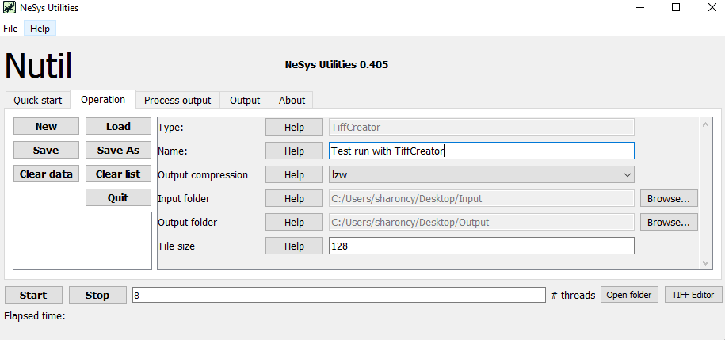
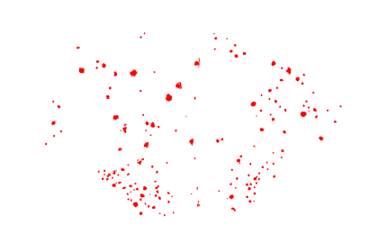
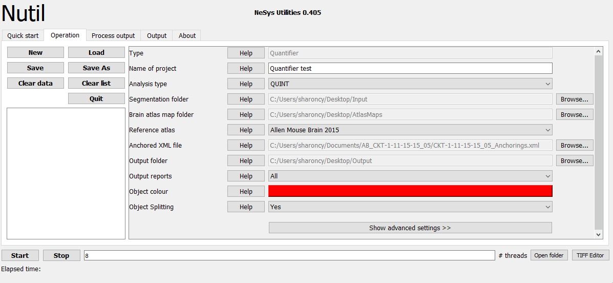
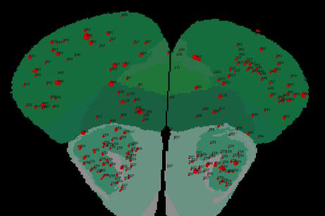
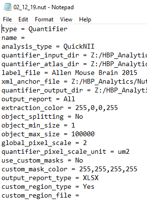
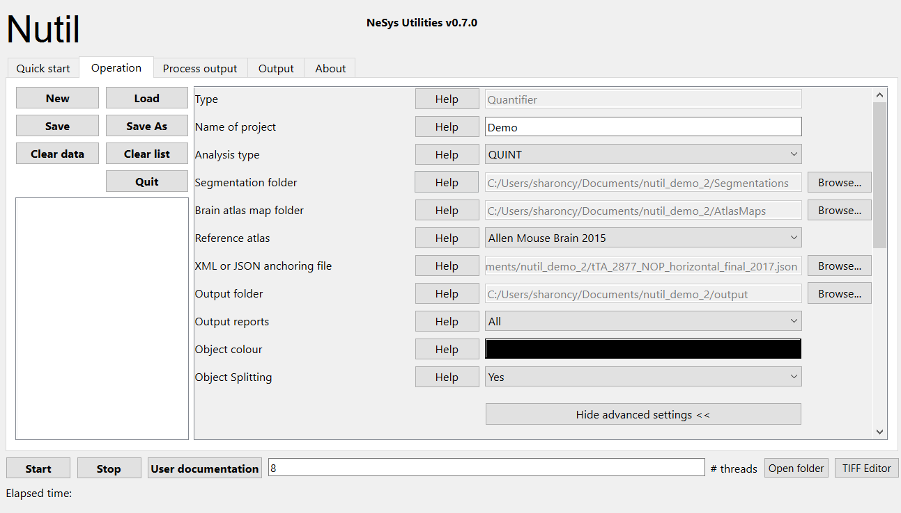

**How to run Quantifier**
==========================

+----------+
| |image23||
+----------+
1. Create three new folders: for example, “Segmentations”, “Atlas_maps” and “Output”. Transfer the segmentations to the "Segmentations" folder, the atlas maps to the "Atlas_maps" folder. Leave the "Output" folder empty. 
2. To begin, click “New”. Enter a name for your project. 
3. Press the “browse” buttons and navigate to the folders containing the segmentations, the atlas maps and the output folder, and to the XML or JSON file containing the registration information.  
4. Select the reference atlas used in QuickNII and VisuAlign.
5. Fill in the rest of the form. The software includes “Help” buttons with more information for each parameter.
6. The “advanced settings” reveals more settings: this gives flexibility for customised analysis. For example, minimum object size cut-off, option to generate customised reports and to apply masks. If nothing is changed in the advanced settings, the default settings shown below are applied.
7. Press “Save as”. This saves a copy of the settings in a simple text file in .NUT format. This is useful for future reference, and may be reloaded into Nutil via the “load” button (for example, to repeat the analysis on a new set of images). 
8. Nutil automatically detects the number of core processors (threads) available on the computer (8 in the example). To ensure adequate processing power, choose at least one less than the total available (6 or 7 here) and press “Start”. Wait until the process is complete: this may take minutes to hours depending on the number of sections and size of the segmentations. If your images are very large and Nutil crashes, select fewer cores.  
9. The output files are automatically saved in the specified output folder. 

+-----------------------------+---------------------------------------+
|    **Advanced Parameter**   |    **Default settings**               |
+=============================+=======================================+
|    Minimum object size      |    1 pixel                            |
+-----------------------------+---------------------------------------+
|    Pixel scale              |    1 pixel                            |
+-----------------------------+---------------------------------------+
|    Use custom masks         |    No                                 |
+-----------------------------+---------------------------------------+
|    Output report type       |    CSV                                |
+-----------------------------+---------------------------------------+
|    Apply customised regions |    Default                            |
+-----------------------------+---------------------------------------+
|    Coordinate extraction    |    All (Yes, for whole series and per |
|                             |    section)                           |
+-----------------------------+---------------------------------------+
|    Pixel density            |    1 coordinate per pixel             |
+-----------------------------+---------------------------------------+
|    Unique ID format         |    _sXXX…                             |
+-----------------------------+---------------------------------------+

**Python plots**
-----------------
Nutil v0.8.0 has a new automatic plotting feature. This will work if Python is installed on the computer (in addition to several Python packages such as numpy, pandas and matplotlib), with the Python.exe selecting in the Nutil File --> Settings.  

**Warnings and error messages**
--------------------------------

.. warning::
   WARNING: Some of the area matrices were not initialized.

This warning informs you that the JSON or XML file contains info about sections that are not included in the analysis. For example, if you run an analysis for a few sections only. This is not a problem - the analysis will produce correct results - but alerts you to missing sections in case this was not intended. 

.. |image1| image:: cfad7c6d57444e3b93185b655ab922e0/media/image2.png
   :width: 6.30139in
   :height: 2.33688in

.. |image3| image:: cfad7c6d57444e3b93185b655ab922e0/media/image4.png
   :width: 6.30139in
   :height: 3.52274in
.. |image4| image:: cfad7c6d57444e3b93185b655ab922e0/media/image5.png
   :width: 6.30139in
   :height: 2.87841in
.. |image5| image:: cfad7c6d57444e3b93185b655ab922e0/media/image5.png
   :width: 6.30139in
   :height: 2.87841in
.. |image6| image:: cfad7c6d57444e3b93185b655ab922e0/media/image5.png
   :width: 6.30139in
   :height: 2.87841in

.. |image8| image:: cfad7c6d57444e3b93185b655ab922e0/media/image7.png
   :width: 1.76111in
   :height: 1.39185in

.. |image10| image:: cfad7c6d57444e3b93185b655ab922e0/media/image7.png
   :width: 1.76111in
   :height: 1.39185in

.. |image12| image:: cfad7c6d57444e3b93185b655ab922e0/media/image7.png
   :width: 1.76111in
   :height: 1.39185in

.. |image14| image:: cfad7c6d57444e3b93185b655ab922e0/media/image10.png
   :width: 1.79722in
   :height: 1.28892in
.. |image15| image:: cfad7c6d57444e3b93185b655ab922e0/media/image10.png
   :width: 1.79722in
   :height: 1.28892in
.. |image16| image:: cfad7c6d57444e3b93185b655ab922e0/media/image10.png
   :width: 1.79722in
   :height: 1.28892in

