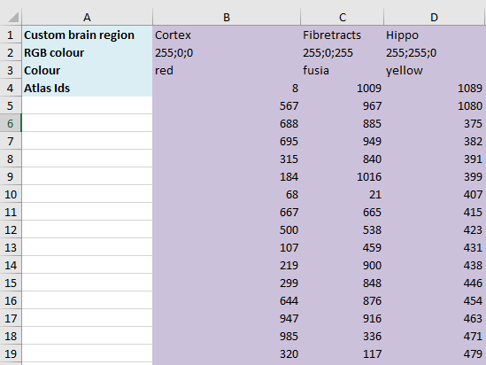

**Nutil: Neuroscience Image Processing and Analysis Utilities**
===============================================================

**Introduction**
----------------

Nutil simplifies the pre-and-post processing of 2D brain image data from mouse and rat. Nutil is developed as a standalone application and requires no experience to execute. The user specifies the input and output folders and the parameters for the pre-and post-processing operations in the Nutil graphical user interface (GUI).

Pre-processing operations include conversion of images from JPEG, PNG and untiled TIFF to tiled TIFF format (*TiffCreator)*; 2D transformations of large tiled TIFF images (rotation, flipping and scaling) in addition to renaming, copying and downsizing (*Transform*); and resizing of JPEG, PNG and TIFF images with output in PNG format (*Resize*).

Post-processing (*Quantifier*) is used for the QUINT workflow. It enables the regional quantification of features such as cells in histological image series of rodent brain, with the regions defined by a reference atlas, such as the Allen Mouse Brain reference atlas or the Waxholm Space Atlas of the Sprague Dawley rat brain. All functions operate in batch, and operate in parallel on multiple CPUs.

**PLEASE visit the EBRAINS page for information about the QUINT workflow and to find tutorials, examples of use, demo videos and software download information:**
|

**Nutil enables four operations detailed further in this user guide:**

1. TiffCreator: convert JPEG, PNG and normal TIFF images to tiled TIFF format.

2. Transform: rename, rotate, resize and compile thumbnails of large tiled TIFF images 

3. Quantifier: for the batch extraction, quantification and spatial analysis of labelling segmented from 2D mouse or rat brain section images (for example, immunohistochemical labelling).

4. Resize: for resizing JPEG/PNG images with output in PNG format.

   .. image:: cfad7c6d57444e3b93185b655ab922e0/media/image1.png
      :width: 2.87083in
      :height: 2.19564in

   **Figure 1**: Nutil GUI.
|

**Installation and usage**
--------------------------

*Nutil* is a stand-alone 64-bit Windows application. There are no installation procedures, just extract the folder and double click on "Nutil.cmd". Nutil is an integral part of the QUINT workflow developed by the Nesys laboratory.

**Licence**: Creative Commons Attribution-NonCommercial-ShareAlike 4.0 International 

**Cite**: Groeneboom NE, Yates SC, Puchades MA and Bjaalie JG (2020) Nutil: A Pre- and Post-processing Toolbox for Histological Rodent Brain Section Images. Front. Neuroinform. 14:37. doi: 10.3389/fninf.2020.00037 

**Also described in**: Yates SC, Groeneboom NE, Coello C, Lichtenthaler SF, Kuhn P-H, Demuth H-U, Hartlage-Rübsamen M, Roßner S, Leergaard T, Kreshuk A, Puchades MA and Bjaalie JG (2019) QUINT: Workflow for Quantification and Spatial Analysis of Features in Histological Images From Rodent Brain. Front. Neuroinform. 13:75. doi: 10.3389/fninf.2019.00075. 

**Funding**: This work was supported by the European Union’s Horizon 2020 Framework Programme for Research and Innovation under the Specific Grant Agreement No. 720270 (Human Brain Project SGA1) and Specific Grant Agreement No. 785907 (Human Brain Project SGA2). 
 

+----------+                    
| |image1| |                    
+----------+                    
                                
..                              
                                
   **Figure 2**: QUINT workflow 

..
|
**Operation: TiffCreator**
--------------------------

TiffCreator converts JPEG, PNG, BMP, GIF and untiled TIFF images to the tiled TIFF format that is compatible with Transform. TiffCreator operates in batch, converting all the images in an input folder and saving them in the specified output folder.  

+----------+
| |image2| |
+----------+

..

   **Figure 3:** TiffCreator GUI

| 1. To begin, click “New”. Select “TiffCreator”.
| 2. Select the input folder (containing the images to be converted),
  output folder and enter the

   TiffCreator parameters in the Nutil GUI (e.g. output compression
   type).

3. Press “Save as”. This saves a copy of the selected settings in a
simple text file in .NUT

   format. The NUT file is for your own records but may be reloaded into
   Nutil via the “load” button.

4. *Nutil* automatically detects the number of core processor available
(8 in the example). Choose

   one less than the total available to ensure adequate processing power
   (6 or 7 here) and press “Start”. Wait until the process is complete.

5. The tiled TIFFs are saved in the specified output folder.

   Nutil includes an inbuilt user manual accessed via the “Help”
   buttons.

..

**Operation: Transform**
------------------------

   | **Transform** allows the batch renaming, rotation, resizing and
     thumbnail compilation of tiled TIFF images (max size: 4 GB).
   | The tiled TIFF image format has an upper size limit of 4 GB.
     *Nutil* cannot transform or generate images that are bigger than 4
     GB.

+----------+
| |image3| |
+----------+

+--------------------------------------------------+------------------+
| **Figure 4:** Transform GUI                      |                  |
| 1. Click “New”. Select “Transform”.              |                  |
| 2. Select the input folder (containing the       |                  |
| images to be transformed), output folder and     |                  |
| enter the transformation parameters in the Nutil |                  |
| GUI. The GUI includes an inbuilt user manual     |                  |
| accessed via the “Help” buttons.                 |                  |
| 3. Once everything is filled in press the “Save  |                  |
| as” button. This saves a copy of the             |                  |
| transformation parameters in a simple text file  |                  |
| in .NUT format. This is for your own records,    |                  |
| but may also be reloaded into Nutil via the      |                  |
| “load” button.                                   |                  |
| 4. *Nutil* automatically detects the number of   |                  |
| core processor available (8 in the example).     |                  |
| Choose one less than the total available to      |                  |
| ensure adequate processing power (6 or 7 here).  |                  |
| 5. Press “Start” and wait until the process is   |                  |
| complete.                                        |                  |
+==================================================+==================+
|                                                  |    [STRIKEOUT:5] |
+--------------------------------------------------+------------------+

..

**Operation: Resize**
----------------------

   **Resize** enables rapid resizing of PNG, JPEG and untiled TIFF
   images by application of a resize factor or a fixed pixel width. The
   output images are in PNG format and are suited for ilastik
   segmentation.

+--------------------------------------------------+------------------+
| +----------+                                     |                  |
| | |image6| |                                     |                  |
| +----------+                                     |                  |
|                                                  |                  |
| ..                                               |                  |
|                                                  |                  |
|    **Figure 5:** Resize GUI                      |                  |
|                                                  |                  |
| | 1. To begin, click “New”. Select “Resize”.     |                  |
| | 2. Select the input folder, output folder and  |                  |
|   resize factor in the Nutil GUI (see the “help” |                  |
|   buttons                                        |                  |
|                                                  |                  |
|    for more information).                        |                  |
|                                                  |                  |
| 3. Press “Save as”. This saves a copy of the     |                  |
| parameters in a simple text file in .NUT format. |                  |
| This                                             |                  |
|                                                  |                  |
|    is for your future records but may also be    |                  |
|    reloaded into Nutil via the “load” button.    |                  |
|                                                  |                  |
| 4. *Nutil* automatically detects the number of   |                  |
| core processor available (8 in the example).     |                  |
| Choose                                           |                  |
|                                                  |                  |
|    one less than the total available to ensure   |                  |
|    adequate processing power (6 or 7 here) and   |                  |
|    press “Start”. Wait until the process is      |                  |
|    complete.                                     |                  |
|                                                  |                  |
| 5. The PNG files save automatically in the       |                  |
| specified output folder.                         |                  |
+==================================================+==================+
|                                                  |    [STRIKEOUT:6] |
+--------------------------------------------------+------------------+

**Operation: Quantifier**
-------------------------

**Quantifier** is an integral part of the QUINT workflow, and enables the regional quantification of features extracted from histological images, based on a reference atlas such as the Allen Mouse Brain Atlas (AMBA) or the Waxholm Atlas of the Spraque Dawley Rat.

**File naming requirements**

"*"The file names of the *segmentation files* and the *brain atlas
   maps* that correspond to a particular section image must contain the same unique ID.

"*"These unique IDs must also be present in the *XML/JSON file*
   containing the anchoring information. This happens automatically as long as the images that are anchored with *QuickNII* contain the unique IDs.

+----------------------------------------------------------------------+
|    **OBS!** The sXXX naming convention applies to both **QuickNII**  |
|    and **Quantifier**\ *.* We therefore recommend changing the file  |
|    names as the first step in the QUINT workflow. This can be done   |
|    with **Transform**\ *(*\ see Figure 1).                           |
+----------------------------------------------------------------------+

..

Quantifier support\ *s* IDs in the format: sXXX.., with XXX..
     representing the section number. The section number should reflect
     the serial order and spacing of the sections (e.g. s002, s006, s010
     for every 4th section starting with section 2). The IDs must match
     those in the XML or JSON file.
   | **Example**: tg2345_MMSH_s001_segmentation.png
   | (It is fine to include a string of letters and numbers followed by
     the unique ID).

   As **Quantifier** scans and detects the \_s part of the name, the
   file name should not contain additional \_s’. Example that would not
   work: tg2345_MMSH_ss_s001.png

    **Quantifier** also supports user-defined IDs using regular
   expressions – RegExp. For more

   information see the “help” button in the Nutil GUI.

..

**Input files**
~~~~~~~~~~~~~~~

+--------------------------------------------------+------------------+
| 1. **Segmentations**                             | +-----------+    |
|                                                  | | |image11| |    |
|    Any image analysis software may be used to    | +-----------+    |
|    generate the segmentations. We use the Pixel  |                  |
|    and Object Classification workflows in the    |                  |
|    *ilastik* software (ilastik.org) with the     |                  |
|    Glasbey LUT applied with Fiji.                |                  |
|                                                  |                  |
|    **Requirement:**                              |                  |
+==================================================+==================+
| |  Must be indexed 8-bit or 24-bit RGB images   |                  |
|   in PNG format.                                 |                  |
| |  Must have the same proportions as the images |                  |
|   *used to generate* the atlas maps. They do not |                  |
|                                                  |                  |
|    | need to be the same size as the images used |                  |
|      to generate the atlas maps, and are         |                  |
|      typically larger in size.                   |                  |
|    | **OBS!** The segmentations will not have    |                  |
|      the same proportions as the actual atlas    |                  |
|      maps as QuickNII alters the proportions     |                  |
|      slightly.                                   |                  |
|                                                  |                  |
|  **Quantifier** is only able to extract one RGB |                  |
| (Red Green Blue) colour at a time. Apply one     |                  |
|                                                  |                  |
|    RBG colour to all of the objects of interest, |                  |
|    and specify this colour code in the GUI (e.g. |                  |
|    the objects in the segmentation here are red, |                  |
|    which is RGB colour code: 255,0,0).           |                  |
|                                                  |                  |
| +--------------------------------------------+   |                  |
| |    **ilastik** is a versatile image        |   |                  |
| |    analysis tool specifically designed for |   |                  |
| |    the classification, segmentation and    |   |                  |
| |    analysis of biological images based on  |   |                  |
| |    supervised machine learning algorithms. |   |                  |
| |                                            |   |                  |
| |    A user manual that describes how to use |   |                  |
| |    *ilastik* in the context of the QUINT   |   |                  |
| |    workflow is included as part of the     |   |                  |
| |    *Nutil* package. See:                   |   |                  |
| |    **ilastikUserManual.**                  |   |                  |
| |                                            |   |                  |
| |    **ilastik is available at:**            |   |                  |
| +--------------------------------------------+   |                  |
|                                                  |                  |
| | 2. **Brain atlas maps**                        |                  |
| | |image12| The atlas maps are customised to     |                  |
|   match the cutting plane and                    |                  |
| | proportions of the brain sections. They are    |                  |
|   generated with the                             |                  |
| | **QuickNII** software (linear registration     |                  |
|   only) or with the                              |                  |
| | **VisuAlign** software (if nonlinear           |                  |
|   refinements are required).                     |                  |
| | They are in .FLAT format.                      |                  |
| | Visit and download here:                       |                  |
| | **3. XML or JSON file containing the anchoring |                  |
|   information.**                                 |                  |
+--------------------------------------------------+------------------+
|                                                  |    [STRIKEOUT:8] |
+--------------------------------------------------+------------------+

..

   Either the XML or JSON file from *QuickNII*, or the JSON file from
   *VisuAlign* may be used. They all contain the linear registration
   information that is needed to generate coordinate output. Nonlinear
   adjustment of the atlas maps with *VisuAlign* does not alter the
   linear coordinate information contained in the file.

+----------------------------------------------------------------------+
|    | **QuickNII** is a standalone software for affine spatial        |
|      registration (anchoring) of section images - typically high     |
|      resolution histological images - to a reference atlas such as   |
|      the Allen Mouse Brain Atlas or the Waxholm Atlas of the Sprague |
|      Dawley Rat. Once all the sections are registered, *QuickNII*    |
|      may be used to generate atlas maps that match the cutting plane |
|      and proportions of the experimental image data. The anchoring   |
|      information (coordinates) is saved and stored in an XML or JSON |
|      file.                                                           |
|    | **Theory:** In *QuickNII*, the reference atlas is transformed   |
|      to match anatomical landmarks in the experimental images. In    |
|      this way, the spatial relationship between experimental image   |
|      and atlas is defined, without introducing transformations in    |
|      the original experimental images.                               |
|    | **Method:** The registration is user-guided with some           |
|      automation. Following anchoring of a limited number of sections |
|      containing key landmarks, transformations are propagated across |
|      the entire series of images to reduce the manual work required. |
|      These propagations must be validated by visual inspection and   |
|      typically require fine adjustments for most sections. A user    |
|      manual that describes how to use *QuickNII* in the context of   |
|      the QUINT workflow is included as part of the *Nutil* package.  |
|      See: **QuickNII userguide.**                                    |
+----------------------------------------------------------------------+

+----------------------------------------------------------------------+
|    | **VisuAlign** is a standalone software for applying nonlinear   |
|      refinements (inplane) to an existing affine 2D-to-3D            |
|      registration (the 2D-to-3D registration is performed with       |
|      *QuickNII* and stored in the JSON file).                        |
|    | **Theory:** It is used to make manual adjustments to the atlas  |
|      maps to better match the sections. The adjustments are          |
|      nonlinear.                                                      |
|    | **Method:** Open the JSON file from *QuickNII* in *VisuAlign*   |
|      and apply adjustments by simple drop and drag of markers placed |
|      on the image. The adjusted atlas maps may then be exported in   |
|      .FLAT format and are compatible with *Quantifier.* *VisuAlign*  |
|      does not update the linear coordinate information contained in  |
|      the JSON file. A user manual that describes how to use          |
|      *VisuAlign* in the context of the QUINT workflow is included as |
|      part of the *Nutil* package. See: **VisuAlign userguide.**      |
+----------------------------------------------------------------------+

..

   **OBS! Make sure your XML or JSON file has anchoring information for
   every section image in your dataset.**

..

**Running Quantifier**
~~~~~~~~~~~~~~~~~~~~~~

+-----------+
| |image13| |
+-----------+

..

   **Figure 5:** *Quantifier* GUI. Note the object colour has to match
   the colour of your segmented objects (here red colour).

1. Create three new folders: for example, titled “Segmentations”,
“Atlas_maps” and “Output”.

   Transfer the s\ *egmentations* to the segmentation folder, the *atlas
   maps* to the atlas map folder. Leave the output folder empty.

| 2. To begin, click “New”. Enter a name for your project.
| 3. Press the “browse” buttons and navigate to the folders containing
  the segmentations, the atlas

   maps and the output folder, and to the XML or JSON file containing
   the anchoring information.

4. Select the reference brain atlas. **This must match the version which
was used to generate**

   **the atlas maps** (Allen mouse brain 2015 or 2017, or Waxholm Space
   Atlas of the Sprague Dawley Rat v2 or v3).

5. Fill in the rest of the form. The software includes an inbuilt user
manual accessible via the

   “Help” buttons, and gives more information for each parameter. Some
   of these are described in more detail in the section below.

6. The “show advanced settings” button reveals more settings that may be
altered (e.g. min

   object size cut-off, option to generate customised reports, etc).
   This gives flexibility for customised analysis. If nothing is changed
   in the advanced settings, the default settings shown below are
   applied.

+-----------------------------+---------------------------------------+
|    **Advanced Parameter**   |    **Default settings**               |
+=============================+=======================================+
|    Minimum object size      |    1 pixel                            |
+-----------------------------+---------------------------------------+
|    Pixel scale              |    1 pixel                            |
+-----------------------------+---------------------------------------+
|    Use custom masks         |    No                                 |
+-----------------------------+---------------------------------------+
|    Output report type       |    CSV                                |
+-----------------------------+---------------------------------------+
|    Apply customised regions |    Default                            |
+-----------------------------+---------------------------------------+
|    Coordinate extraction    |    All (Yes, for whole series and per |
|                             |    section)                           |
+-----------------------------+---------------------------------------+
|    Pixel density            |    1 coordinate per pixel             |
+-----------------------------+---------------------------------------+
|    Nifti size               |    0 (no nifti file generated)        |
+-----------------------------+---------------------------------------+
|    Unique ID format         |    \_sXXX…                            |
+-----------------------------+---------------------------------------+

+===============================+===+===============================+
| 7. Press “Save as”. This      |   |                               |
| saves a copy of the settings  |   |                               |
| in a simple text file in .NUT |   |                               |
| format. This is useful for    |   |                               |
| future reference, and may be  |   |                               |
| reloaded into *Nutil* via the |   |                               |
| “load” button (for example,   |   |                               |
| to repeat the analysis on a   |   |                               |
| new set of images).           |   |                               |
| 8. *Nutil* automatically      |   |                               |
| detects the number of core    |   |                               |
| processor (threads) available |   |                               |
| on the computer (8 in the     |   |                               |
| example). To ensure adequate  |   |                               |
| processing power, choose one  |   |                               |
| less than the total available |   |                               |
| (6 or 7 here) and press       |   |                               |
| “Start”. Wait until the       |   |                               |
| process is complete.          |   |                               |
| 9. The output files are       |   |                               |
| automatically saved in the    |   |                               |
| specified output folder.      |   |                               |
+-------------------------------+---+-------------------------------+

..

   .. image:: cfad7c6d57444e3b93185b655ab922e0/media/image9.png
      :width: 6.30139in
      :height: 3.41511in

   **Figure 6:** Quantifier advanced settings GUI

..

**Quantifier settings explained**
~~~~~~~~~~~~~~~~~~~~~~~~~~~~~~~~~

   *Nutil* has “help” buttons throughout with information on each
   parameter.

   Some of the Quantifier settings are described in more detail below:

   **Object splitting**

   In Quantifier, users must specify whether to turn on or off “object
   splitting”. Object splitting divides segmented objects that overlap
   atlas regions, with individual pixels assigned their precise
   location. This gives accurate load measurements (load is the
   percentage of the region occupied by objects), but invalidates the
   object counts.

   | **Recommendation:**
   | Select *NO* for small objects to get accurate object counts (e.g.
     cells).
   | Select *YES* for large objects that overlap atlas regions (e.g.
     connectivity data). This gives precise load output. See the help
     button for more information.

   **Custom masks**

   The mask feature is optional. It allows the application of masks to
   define which parts of the sections to *include* in the analysis. The
   mask is applied in addition to, and not instead of, the reference
   atlas maps. This is particularly useful for investigating expression
   differences in the right and left hemisphere, as a mask can be
   applied to differentiate the two sides.

+-----------------------------------------------------+---------------+
|  To use the mask feature, select “yes”. This       | +-----------+ |
| brings up a “custom                                 | | |image16| | |
|                                                     | +-----------+ |
|    mask folder” and “Custom mask colour” option.    |               |
|                                                     |               |
|  Create binary masks (black and white) in PNG      |               |
| format with an                                      |               |
|                                                     |               |
|    application such as *NIH ImageJ*, *Adobe         |               |
|    Photoshop* or *GIMP*. These should have the same |               |
|    proportions as the segmentations (but not        |               |
|    necessarily the same size).                      |               |
|                                                     |               |
|  Name these with the unique ID for the section and |               |
| a “_mask”                                           |               |
|                                                     |               |
|    extension. File name example: Bxb_hgt_s002_mask  |               |
+-----------------------------------------------------+---------------+

|  Navigate to this folder containing the masks.
|  Click on the field for the “Custom mask colour”. Select the colour
  in the mask that

   corresponds to the ROI to *include* in the analysis. For example, for
   an analysis of the left hand side of an image with the mask shown
   here, specify black (RGB code: 0,0,0).

..

**Customised reports**
~~~~~~~~~~~~~~~~~~~~~~

Quantifier generates two or three sets of reports:

"*" *RefAtlasRegion* reports contain quantifications per atlas region
based on the finest level of granularity of the atlas.

"*" *CustomRegion* reports contain quantifications for broader regions,
such as cortex and hippocampus (“default”), or user defined regions (“custom”).

"*" *Object* reports contain information about individual objects and are only generated with object splitting switched OFF.

   | The custom regions are compilations of reference atlas regions.
     Users have the option to either define their own using the
     CustomRegionsTemplate.xlsx, or to use the default regions included
     in the *Nutil* software. More information on the default regions
     are found in the CustomRegion files in the *Nutil* package (see
     folder titled “CustomRegion” and navigate to the xlsx file that
     corresponds to your atlas). The “default” option is a whole brain
     analysis. It includes all the reference atlas regions subdivided
     into broad regions.

   .. image:: cfad7c6d57444e3b93185b655ab922e0/media/image11.png
      :width: 6.3in
      :height: 0.61941in

**How to define your own regions**
~~~~~~~~~~~~~~~~~~~~~~~~~~~~~~~~~~

1. To define your own regions, use the *CustomRegionsTemplate.xlsx* that
is included in the Nutil package, and populate as described below:

**ROW 1:** assign your own names to the regions (e.g. Cortex).

**ROW 2**: assign colours to the regions. Do this by typing a RGB colour
code in the following format: 255;0;0 (for red). This colour will be
assigned to the objects located in the custom region for the purposes of
the image and coordinate output (for display purposes only).

**ROW 3**: enter the colour name (this is for your information only).

| **ROW 4**: define the region by listing the reference atlas IDs that
  you wish to include. The excel sheets in the AtlasHierarchy folder
  list all the regions and IDs for each atlas.
| For mouse, see the *ABAHier2015.xlsx or ABAHier2017.xlsx* file for the
  full list of regions and IDs.
| For rat, see the *WHS_rat_atlas_v2.xlsx or WHS_rat_atlas_v3.xlsx* file
  for the full list of regions and IDs.
| NOTE: The default .xlsx may be used as a guide for filling out the
  template.

..

**How to interpret the output**
~~~~~~~~~~~~~~~~~~~~~~~~~~~~~~~

**1. Reports** (CSV or HTML format)

   .. image:: cfad7c6d57444e3b93185b655ab922e0/media/image13.png
      :width: 5.88611in
      :height: 2.86512in

   **RefAtlasRegions**

+-----------------------------------------------------------------+---+
|    Report with output organised based on all the regions in the |   |
|    reference atlas: per section and for the whole series (all   |   |
|    sections combined).                                          |   |
|                                                                 |   |
| +-----------------------------------------------------------+   |   |
| |    | **IMPORTANT**: The *Allen Mouse Brain Reference      |   |   |
| |      Atlas* includes regions that are not actually        |   |   |
| |      delineated in the atlas. These regions are either    |   |   |
| |      big regions that have been delineated into smaller   |   |   |
| |      regions and so are not assigned to any pixels in the |   |   |
| |      reference atlas, or are smaller regions that are not |   |   |
| |      delineated. In the reports, these regions have no    |   |   |
| |      results (zero for region pixels and for object       |   |   |
| |      pixels) and should be excluded from analysis.        |   |   |
| |    | The **Clear Label ID** covers objects that fall      |   |   |
| |      outside of the atlas maps.                           |   |   |
| +-----------------------------------------------------------+   |   |
+=================================================================+===+
| **CustomRegions**                                               |   |
+-----------------------------------------------------------------+---+

..

   | Reports with the output organised based on the customised regions
     defined in the
   | CustomRegionsTemplate.xlsx: per section and for the whole series.

   **Objects**

   List of all the objects in the whole series and per section. By
   switching “ON” the “display object IDs in image file and reports”
   feature, a unique ID is assigned to each object in your dataset.
   These IDs are then displayed in the image files and in the object
   reports.

..

   In each report, interpret the results as follows:

+----------------------+----------------------------------------------+
|    **Region pixels** |    No. of pixels representing the region.    |
+======================+==============================================+
|    **Region area**   |    Area representing the region              |
+----------------------+----------------------------------------------+
|    **Area unit**     |    Region area unit                          |
+----------------------+----------------------------------------------+
|    **Object count**  |    No. of objects located in the region.     |
|                      |                                              |
|                      |    | NOTE: Object counts are not generated   |
|                      |      if object splitting is                  |
|                      |    | switched “on”.                          |
+----------------------+----------------------------------------------+
|    **Object pixels** |    No. of pixels representing objects in     |
|                      |    this region.                              |
+----------------------+----------------------------------------------+
|    **Object area**   |    Area representing objects in this region. |
+----------------------+----------------------------------------------+
|    **Load**          |    Ratio of Object pixels to Region pixels   |
|                      |    (Object pixels/Region                     |
|                      |                                              |
|                      |    pixels).                                  |
+----------------------+----------------------------------------------+

**2. IMAGES**

+--------------------------------------------+-------------------+---+
|  Segmentations superimposed on the atlas  | |image19|         |   |
| maps in PNG                                |                   |   |
|                                            |                   |   |
|    format.                                 |                   |   |
|                                            |                   |   |
|  The object colours are assigned based on |                   |   |
| the customised                             |                   |   |
|                                            |                   |   |
|    regions. If no regions are specified,   |                   |   |
|    or object falls outside of the          |                   |   |
|    specified areas, the objects are shown  |                   |   |
|    in red by default.                      |                   |   |
+============================================+===================+===+
|                                            |    [STRIKEOUT:16] |   |
+--------------------------------------------+-------------------+---+
   |
|                       |                   |                       |
|                       |                   | .. image:: cfad7c6d   |
|                       |                   | 57444e3b93185b655ab92 |
|                       |                   | 2e0/media/image15.png |
|                       |                   |    :width: 2.68889in  |
|                       |                   |    :height: 2.03483in |
|                       |                   |                       |
|                       |                   | +-----------+         |
|                       |                   | | |image22| |         |
|                       |                   | +-----------+         |
+=======================+===================+=======================+
| **3. COORDINATES**    |                   |                       |
|                       |                   |                       |
|    | JSON files       |                   |                       |
|      containing point |                   |                       |
|      clouds that can  |                   |                       |
|      be visualised    |                   |                       |
|      with the         |                   |                       |
|      *MeshView Atlas  |                   |                       |
|      Viewer*.         |                   |                       |
|    | The vWiki link   |                   |                       |
|      here:            |                   |                       |
|                       |                   |                       |
| **4. NUT file**       |                   |                       |
|                       |                   |                       |
|    The NUT file is a  |                   |                       |
|    text file          |                   |                       |
|    containing the     |                   |                       |
|    analysis settings. |                   |                       |
|    This can be loaded |                   |                       |
|    into Nutil         |                   |                       |
|    Quantifier with    |                   |                       |
|    the “load” button. |                   |                       |
|                       |                   |                       |
|    To view, open with |                   |                       |
|    *Notepad.*         |                   |                       |
+-----------------------+-------------------+-----------------------+
|                       |    [STRIKEOUT:17] |                       |
+-----------------------+-------------------+-----------------------+

..

**Technical information**
-------------------------

*Download:* https://www.nitrc.org/projects/nutil/ 

Nutil is written as a stand-alone windows 64-bit application written in Qt C++, which enables the full usage of both memory and processor cores. Nutil can be downloaded and compiled from the github page. When performing batch processes, Nutil will utilise all cores available on the system.  

The external libraries that are used in Nutil are: 
 
"*" Libtiff for fast and efficient TIFF file handling (http://www.libtiff.org/) 
"*" LibXLNT for excel file IO (https://github.com/tfussell/xlnt/) 

**TiffCreator**

TiffCreator produces tiled TIFF files from JPEG, PNG and standard TIFF images, and employs the support of multiple CPUs for efficient, parallelised operations. 

**Transform** 

Transform enables rotations, scaling and thumbnail compilation of large tiff files (currently up to 4GB).  

**Quantifier**

Quantifier identifies individual binary objects in a PNG file, while matching these to output from QuickNII. The method first finds and sorts areas by using a standard pixel filler routine. Afterwards, a random area pixel is chosen as the look-up in the binary QuickNII label slice for this particular image. When all areas have been assigned a label ID, multiple selections of predefined area IDs are assembled (ID list from the excel input file), and finally output reports are assembled and written to disk (in xlsl format). In addition, original ilastik .png files with colour/ID coding added to underlying atlas slice data are assembled and saved to the output folder. 

**Authors**

Nicolaas E Groeneboom, Sharon C. Yates, Maja A. Puchades, Jan G. Bjaalie. 

**Licence**

Creative Commons Attribution-NonCommercial-ShareAlike 4.0 International 

**Cite**
Groeneboom NE, Yates SC, Puchades MA and Bjaalie JG (2020) Nutil: A Pre- and Postprocessing Toolbox for Histological Rodent Brain Section Images. Front. Neuroinform. 14:37. doi: 10.3389/fninf.2020.00037

Yates SC, Groeneboom NE, Coello C, Lichtenthaler SF, Kuhn P-H, Demuth H-U, HartlageRübsamen M, Roßner S, Leergaard T, Kreshuk A, Puchades MA and Bjaalie JG (2019) QUINT: Workflow for Quantification and Spatial Analysis of Features in Histological Images From Rodent Brain. Front. Neuroinform. 13:75. doi: 10.3389/fninf.2019.00075. 

**Acknowledgements**

Nutil was development with support from the European Union’s Horizon 2020 Framework Programme for Research and Innovation under the Specific Grant Agreement No. 720270 (Human Brain Project SGA1) and Specific Grant Agreement No. 785907 (Human Brain Project SGA2). 

**Release notes**

Can be found on https://www.nitrc.org/frs/?group_id=1365 

**Contact us** 

Report issues: https://github.com/Neural-Systems-at-UIO/nutil 

**Slack workspace for informal discussion:** quint-uiq9333.slack.com 

.. |image1| image:: cfad7c6d57444e3b93185b655ab922e0/media/image2.png
   :width: 6.30139in
   :height: 2.33688in
.. |image2| image:: cfad7c6d57444e3b93185b655ab922e0/media/image3.png
   :width: 6.30139in
   :height: 2.95442in
.. |image3| image:: cfad7c6d57444e3b93185b655ab922e0/media/image4.png
   :width: 6.30139in
   :height: 3.52274in
.. |image4| image:: cfad7c6d57444e3b93185b655ab922e0/media/image5.png
   :width: 6.30139in
   :height: 2.87841in
.. |image5| image:: cfad7c6d57444e3b93185b655ab922e0/media/image5.png
   :width: 6.30139in
   :height: 2.87841in
.. |image6| image:: cfad7c6d57444e3b93185b655ab922e0/media/image5.png
   :width: 6.30139in
   :height: 2.87841in
.. |image7| image:: cfad7c6d57444e3b93185b655ab922e0/media/image6.png
   :width: 2.05417in
   :height: 1.39783in
.. |image8| image:: cfad7c6d57444e3b93185b655ab922e0/media/image7.png
   :width: 1.76111in
   :height: 1.39185in
.. |image9| image:: cfad7c6d57444e3b93185b655ab922e0/media/image6.png
   :width: 2.05417in
   :height: 1.39783in
.. |image10| image:: cfad7c6d57444e3b93185b655ab922e0/media/image7.png
   :width: 1.76111in
   :height: 1.39185in
.. |image11| image:: cfad7c6d57444e3b93185b655ab922e0/media/image6.png
   :width: 2.05417in
   :height: 1.39783in
.. |image12| image:: cfad7c6d57444e3b93185b655ab922e0/media/image7.png
   :width: 1.76111in
   :height: 1.39185in
.. |image13| image:: cfad7c6d57444e3b93185b655ab922e0/media/image8.png
   :width: 5.90694in
   :height: 2.724in
.. |image14| image:: cfad7c6d57444e3b93185b655ab922e0/media/image10.png
   :width: 1.79722in
   :height: 1.28892in
.. |image15| image:: cfad7c6d57444e3b93185b655ab922e0/media/image10.png
   :width: 1.79722in
   :height: 1.28892in
.. |image16| image:: cfad7c6d57444e3b93185b655ab922e0/media/image10.png
   :width: 1.79722in
   :height: 1.28892in
.. |image17| image:: cfad7c6d57444e3b93185b655ab922e0/media/image14.png
   :width: 2.30556in
   :height: 1.53537in
.. |image18| image:: cfad7c6d57444e3b93185b655ab922e0/media/image14.png
   :width: 2.30556in
   :height: 1.53537in
.. |image19| image:: cfad7c6d57444e3b93185b655ab922e0/media/image14.png
   :width: 2.30556in
   :height: 1.53537in
.. |image20| image:: cfad7c6d57444e3b93185b655ab922e0/media/image16.png
   :width: 2.59306in
   :height: 3.53443in
.. |image21| image:: cfad7c6d57444e3b93185b655ab922e0/media/image16.png
   :width: 2.59306in
   :height: 3.53443in
.. |image22| image:: cfad7c6d57444e3b93185b655ab922e0/media/image16.png
   :width: 2.59306in
   :height: 3.53443in
