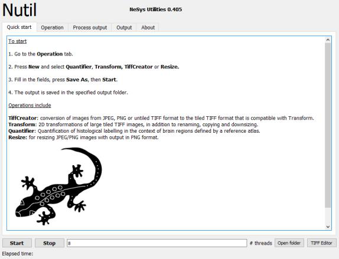

**Introduction**
----------------

*Nutil* simplifies the pre-and-post processing of 2D brain image data from mouse and rat. Nutil is developed as a standalone application and requires no experience to execute. The user specifies the input and output folders and the parameters for the pre-and post-processing operations in the Nutil graphical user interface (GUI).

Pre-processing operations include conversion of images from JPEG, PNG and untiled TIFF to tiled TIFF format (*TiffCreator)*; 2D transformations of large tiled TIFF images (rotation, flipping and scaling) in addition to renaming, copying and downsizing (*Transform*); and resizing of JPEG, PNG and TIFF images with output in PNG format (*Resize*).

Post-processing (*Quantifier*) is used for the QUINT workflow. It enables the regional quantification of features such as cells in histological image series of rodent brain, with the regions defined by a reference atlas, such as the Allen Mouse Brain reference atlas or the Waxholm Space Atlas of the Sprague Dawley rat brain. All functions operate in batch, and operate in parallel on multiple CPUs.

+----------+                    
| |image1| |                    
+----------+                    
                            

**PLEASE visit the EBRAINS page for more information about the QUINT workflow and to find tutorials, examples of use, demo videos and software download information.**

|
**Nutil operations**

1. **TiffCreator**: convert JPEG, PNG and normal TIFF images to tiled TIFF format.
2. **Transform**: rename, rotate, resize and compile thumbnails of large tiled TIFF images.
3. **Quantifier**: for the batch extraction, quantification and spatial analysis of labelling segmented from 2D mouse or rat brain section images (for example, immunohistochemical labelling).
4. **Resize**: for resizing JPEG/PNG images with output in PNG format.

|

.. |image1| image:: cfad7c6d57444e3b93185b655ab922e0/media/image2.png
   :width: 6.30139in
   :height: 2.33688in
